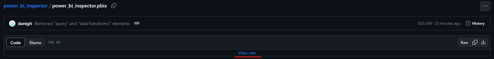
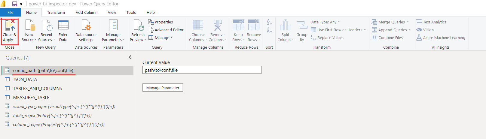
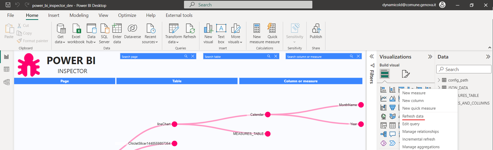
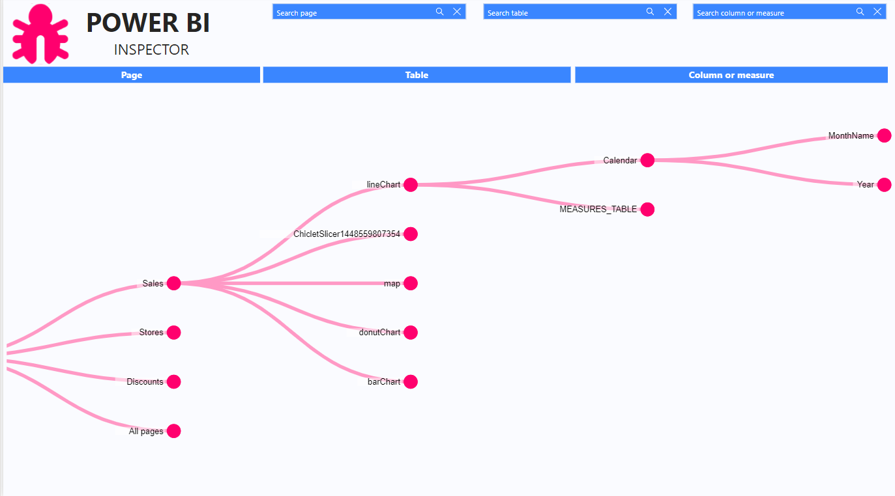

</br>
</br>
</br>

## Requirements 

</br>
In order to use Power BI Inspector you have to have installed on your computer the `Python environment` and the `os`, 'shutil`, `zipfile`, 

</br>

## Step 1 - Export Power BI template

</br>

Open the Power BI file that you want to inspect go to `File > Expoert > Power BI template`. This will export the file as a Power BI template (you will se a file with `.pbit` extension). For each file that you want to inspect, first you have to export it as a Power BI template.

</br>

## Step 2 - Download the Power BI file 

</br>

### From terminal using `curl'

</br>

Open a terminal window, go in the folder where you want to download the file, and paste the following command: 
```
curl -o power_bi_inspector.pbix https://github.com/danigit/power_bi_inspector/blob/master/power_bi_inspector.pbix
```

</br>

### From GitHub

</br>

Go to the following GitHub page https://github.com/danigit/power_bi_inspector/blob/master/power_bi_inspector.pbix and click on `View raw` and the file will start downloading.



</br>

## Step 3 - Create configuration file

</br>

Create a json configuration file in a directory you choose and paste inside the following:

```
[
    {"param_name": "pbit_path", "param_value":"path\to\the\pbix\file\that\you\want\to\inspect"},
    {"param_name": "pbit_file_name", "param_value": "<name_of_the_file>"}
]
```

Remember to change the `path\to\the\pbix\file\that\you\want\to\inspect` with the path where your `.pbit` file is, and the `<name_of_the_file>` with the actual name of the file you wanto to inspect.

</br>

## Step 4 - Set up the variables

</br>

In the `power_bi_inspector.pbix` file which you open in Power BI go to Power Query Editor, on the left you find a parameter called `config_path`. Set the value of this parameter with the path where the config file which you created above is saved. The click on the `Close & Apply` button to close save and close Power Query Editor.



</br>

## Step 5 - Load the data

</br>

Now refresh first the `JSON_DATA` table by right clicking on it and selection `Resfres data`, then refresh the `TABLES_AND_COLUMNS` table.



</br>

## Step 6 - Inspect your file

</br>

Done you can now inspect the loaded file and see where your tables, columns and measures are used.



## Load another file

</br>

To load another file for the inspection all you have to do is to change the path and name of the file in the config file, and then load again the tables (Step 4).